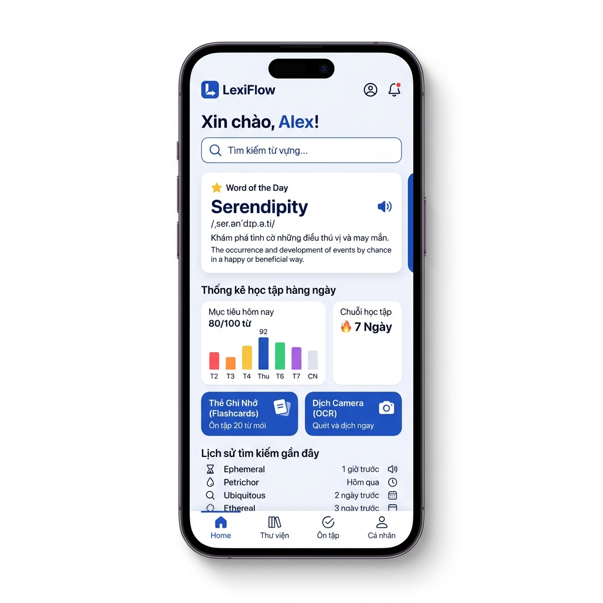
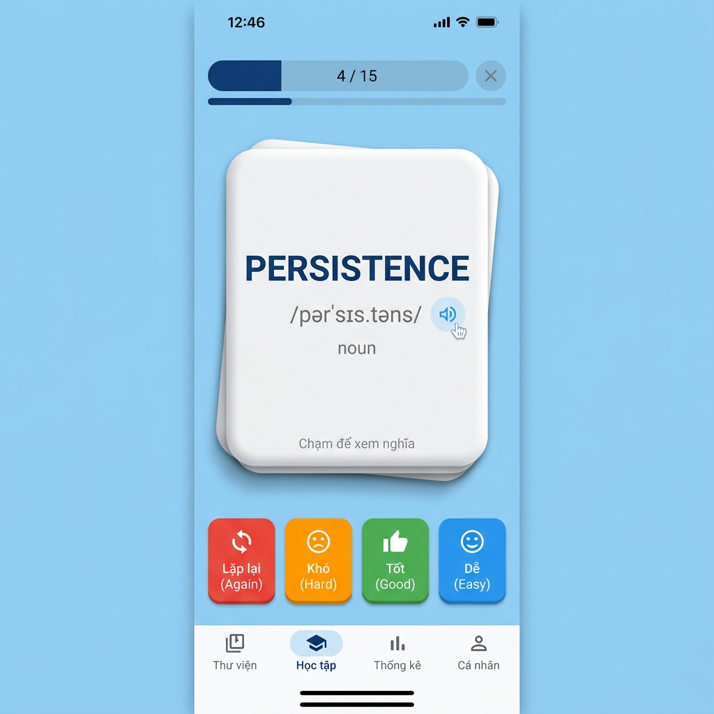
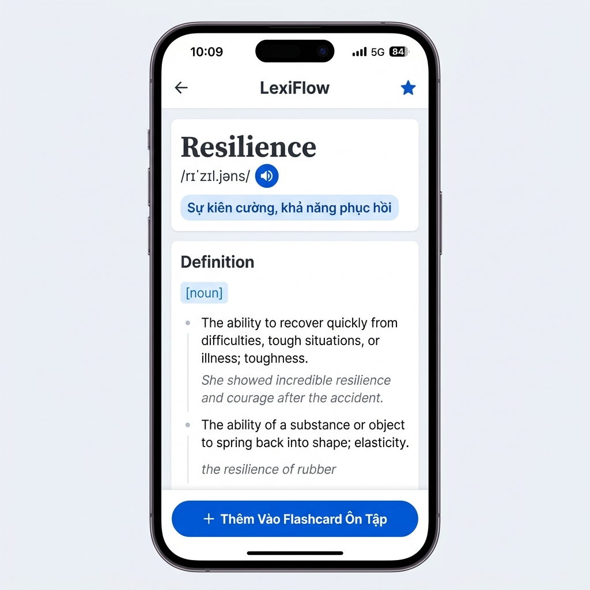

# 📘 TÀI LIỆU HÌNH ẢNH & CHI TIẾT MÀN HÌNH DỰ ÁN LEXIFLOW

> **Phiên bản:** 1.0.0+1  
> **Ứng dụng:** LexiFlow (Modern Oxford & Spaced Repetition Dictionary)  
> **Thư mục hình ảnh:** `docs/images/`

---

## 📋 MỤC LỤC

1. [Tổng quan Giao diện System](#1-tổng-quan-giao-diện-system)
2. [Chi tiết từng Màn hình & Hình ảnh](#2-chi-tiết-từng-màn-hình--hình-ảnh)
   - [2.1. Màn hình Dashboard Chính](#21-màn-hình-dashboard-chính)
   - [2.2. Màn hình Học Flashcard (SM-2)](#22-màn-hình-học-flashcard-sm-2)
   - [2.3. Màn hình Chi tiết Từ vựng](#23-màn-hình-chi-tiết-từ-vựng)
   - [2.4. Màn hình Dịch Qua Camera (OCR)](#24-màn-hình-dịch-qua-camera-ocr)
   - [2.5. Màn hình Đăng nhập & Đăng ký](#25-màn-hình-đăng-nhập--đăng-ký)
   - [2.6. Màn hình Cài đặt & Bookmarks](#26-màn-hình-cài-đặt--bookmarks)
3. [Quy chuẩn Thiết kế UI/UX (Design Tokens)](#3-quy-chuẩn-thiết-kế-uiux-design-tokens)

---

## 1. TỔNG QUAN GIAO DIỆN SYSTEM

LexiFlow sử dụng ngôn ngữ thiết kế **Material 3** kết hợp phông chữ **Outfit** chuẩn Google Fonts và tông màu chủ đạo **Royal Blue (#2563EB)** tạo cảm giác hiện đại, thanh lịch và tập trung cho việc học từ vựng.

---

## 2. CHI TIẾT TỪNG MÀN HÌNH & HÌNH ẢNH

### 2.1. Màn hình Dashboard Chính

- **File Code:** [dashboard_screen.dart](file:///e:/%C4%90%E1%BB%92%20%C3%81N%20T%E1%BB%90T%20NGHI%E1%BB%86P/lexiflow-backup-V1.0/lib/presentation/screens/dashboard_screen.dart)
- **Hình ảnh lưu tại:** `docs/images/dashboard.png`

**Các thành phần chính:**
- **Thanh tìm kiếm (Search Bar):** Hỗ trợ gõ từ tra nhanh, tích hợp Autocomplete gợi ý từ DataMuse API với Debounce 300ms.
- **Lời chào cá nhân:** Hiển thị tên tài khoản người dùng đăng nhập.
- **Word of the Day (Từ vựng mỗi ngày):** Chọn lọc 8 từ nâng cao luân phiên theo ngày trong năm, kèm phiên âm IPA và icon phát âm giọng chuẩn.
- **Thống kê học tập (Learning Stats):** Biểu đồ Bar Chart trực quan phân loại từ vựng thành: *Chưa học*, *Đang học*, *Đã thuộc*.
- **Streak tracking:** Chuỗi số ngày học liên tiếp được tính thực tế từ Firestore.
- **Navigation Cards:** Lối tắt đẹp mắt dẫn sang *Thẻ Ghi Nhớ (Flashcard)* và *Dịch Camera (OCR)*.
- **Lịch sử tra từ:** Hiển thị 5 từ tra cứu gần nhất, hỗ trợ swipe-to-delete và nút Xóa tất cả với Dialog xác nhận.

---

### 2.2. Màn hình Học Flashcard (SM-2)

- **File Code:** [flashcard_study_screen.dart](file:///e:/%C4%90%E1%BB%92%20%C3%81N%20T%E1%BB%90T%20NGHI%E1%BB%86P/lexiflow-backup-V1.0/lib/presentation/screens/flashcard_study_screen.dart) | [spaced_repetition.dart](file:///e:/%C4%90%E1%BB%92%20%C3%81N%20T%E1%BB%90T%20NGHI%E1%BB%86P/lexiflow-backup-V1.0/lib/core/utils/spaced_repetition.dart)
- **Hình ảnh lưu tại:** `docs/images/flashcard.png`

**Các thành phần chính:**
- **Progress Header:** Thanh tiến độ tuyến tính `(current / total)` hiển thị trực quan tỷ lệ hoàn thành lượt học.
- **Thẻ 3D Flip Card:** 
  - **Mặt trước:** Từ tiếng Anh, từ loại, phiên âm IPA, nút phát âm Audio.
  - **Mặt sau:** Nghĩa tiếng Việt, ví dụ câu sử dụng thực tế.
- **4 Nút đánh giá Thuật toán SM-2:**
  - 🔴 **Lặp lại (Again - q=0):** Thẻ sẽ xuất hiện lại ngay trong phiên học.
  - 🟠 **Khó (Hard - q=2):** Giảm hệ số Ease Factor, đặt khoảng thời gian ngắn.
  - 🟢 **Tốt (Good - q=4):** Khoảng thời gian ôn tập tiêu chuẩn.
  - 🔵 **Dễ (Easy - q=5):** Tăng Ease Factor và mở rộng khoảng thời gian ôn tập.

---

### 2.3. Màn hình Chi tiết Từ vựng

- **File Code:** [vocab_detail_screen.dart](file:///e:/%C4%90%E1%BB%92%20%C3%81N%20T%E1%BB%90T%20NGHI%E1%BB%86P/lexiflow-backup-V1.0/lib/presentation/screens/vocab_detail_screen.dart) | [dictionary_service.dart](file:///e:/%C4%90%E1%BB%92%20%C3%81N%20T%E1%BB%90T%20NGHI%E1%BB%86P/lexiflow-backup-V1.0/lib/data/datasources/dictionary_service.dart)
- **Hình ảnh lưu tại:** `docs/images/vocab_detail.png`

**Các thành phần chính:**
- **Header:** Từ tiếng Anh chính, nút Bookmark icon sao, phiên âm IPA quốc tế và icon phát âm audio.
- **Bảng dịch tiếng Việt:** Nổi bật với background soft blue, cung cấp nghĩa tiếng Việt chính xác.
- **Định nghĩa Oxford tiếng Anh:** Liệt kê tối đa 5 định nghĩa kèm nhãn từ loại (`noun`, `verb`, `adjective`...).
- **Ví dụ thực tế:** Mỗi định nghĩa đi kèm ví dụ câu mẫu giúp người dùng nắm vững ngữ cảnh.
- **Thao tác 1 chạm:** Nút nổi bật `+ Thêm Vào Flashcard Ôn Tập` lưu ngay từ này vào thuật toán lặp lại ngắt quãng.

---

### 2.4. Màn hình Dịch Qua Camera (OCR)

- **File Code:** [ocr_translator_screen.dart](file:///e:/%C4%90%E1%BB%92%20%C3%81N%20T%E1%BB%90T%20NGHI%E1%BB%86P/lexiflow-backup-V1.0/lib/presentation/screens/ocr_translator_screen.dart)

**Các thành phần chính:**
- **Scanner Overlay:** Khung camera với 4 góc bo sáng chuyên nghiệp cho phép căn chỉnh vùng quét.
- **Nhận dạng ML Kit:** Dùng `google_mlkit_text_recognition` nhận diện nhanh văn bản từ camera hoặc ảnh tải lên từ gallery.
- **Chip Selection Layout:** Danh sách từ được nhận dạng hiển thị thành dạng thẻ chip nhấp được.
- **Quick Translation Sheet:** Bấm vào từ bất kỳ để hiển thị ngay Bottom Sheet nghĩa tiếng Việt và phiên âm mà không cần rời màn hình camera.

---

### 2.5. Màn hình Đăng nhập & Đăng ký

- **File Code:** [auth_screen.dart](file:///e:/%C4%90%E1%BB%92%20%C3%81N%20T%E1%BB%90T%20NGHI%E1%BB%86P/lexiflow-backup-V1.0/lib/presentation/screens/auth_screen.dart) | [auth_service.dart](file:///e:/%C4%90%E1%BB%92%20%C3%81N%20T%E1%BB%90T%20NGHI%E1%BB%86P/lexiflow-backup-V1.0/lib/services/auth_service.dart)

**Các thành phần chính:**
- **Tab switch:** Chuyển đổi giữa *Đăng nhập* và *Đăng ký*.
- **Form validation:** Kiểm tra định dạng Email regex và mật khẩu tối thiểu 6 ký tự.
- **Xử lý lỗi tiếng Việt:** Thông báo lỗi Firebase Auth được chuyển sang Tiếng Việt thân thiện (ví dụ: *"Sai mật khẩu"*, *"Email đã được sử dụng"*).

---

### 2.6. Màn hình Cài đặt & Bookmarks

- **File Code:** [settings_screen.dart](file:///e:/%C4%90%E1%BB%92%20%C3%81N%20T%E1%BB%90T%20NGHI%E1%BB%86P/lexiflow-backup-V1.0/lib/presentation/screens/settings_screen.dart) | [bookmarks_screen.dart](file:///e:/%C4%90%E1%BB%92%20%C3%81N%20T%E1%BB%90T%20NGHI%E1%BB%86P/lexiflow-backup-V1.0/lib/presentation/screens/bookmarks_screen.dart)

**Các thành phần chính:**
- **Theme Mode Switcher:** Chuyển đổi qua 3 chế độ: *Light (Sáng)*, *Dark (Tối)*, *System (Theo hệ thống)*.
- **Bookmarks List:** Xem tất cả từ đã lưu, hỗ trợ tìm kiếm nội bộ và sắp xếp thứ tự A-Z / Z-A.
- **Notification Settings:** Cài đặt và kích hoạt lại lịch thông báo từ vựng hàng ngày lúc 9:00 AM.

---

## 3. QUY CHUẨN THIẾT KẾ UI/UX (DESIGN TOKENS)

| Quy chuẩn | Mã / Mô tả |
|---|---|
| **Màu chủ đạo (Primary Color)** | Royal Blue (`#2563EB`) |
| **Màu nền phụ (Secondary Background)** | Soft Blue (`#EFF6FF`) |
| **Màu văn bản (Text Slate)** | Slate Dark (`#1E293B`) |
| **Font chữ (Typography)** | Google Fonts `Outfit` |
| **Bo góc (Border Radius)** | 16px - 24px |
| **Animation Chuyển Màn hình** | Slide & Fade 500ms |

---
*Tài liệu được cập nhật tự động vào hệ thống dự án LexiFlow.*
